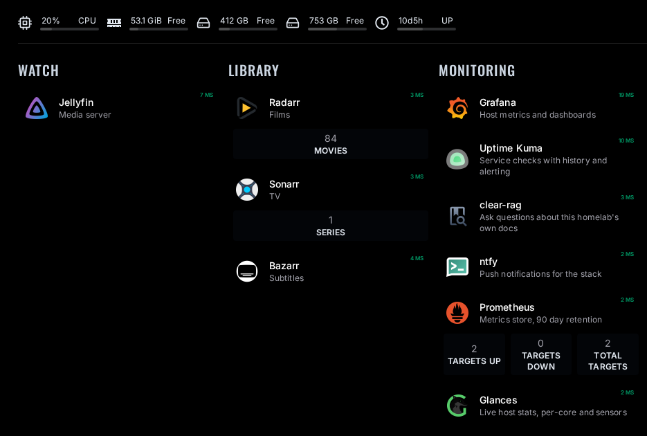

# hvenrylab

A Docker Compose homelab on one Arch laptop, serving a personal media library, local AI and small apps at `https://<name>.hvenry.com`, reachable only over Tailscale.



## Features

- Jellyfin with NVENC transcoding on an RTX 3070, with Radarr, Sonarr and Bazarr organising the library
- Every service on its own HTTPS name, with no port open to the internet
- One 8 GB GPU shared by transcoding, an LLM and a background-removal model, tuned not to collide
- Grounded answers about the homelab from its own docs, via local Ollama and clear-rag
- Host metrics, uptime checks, image update alerts and nightly restic backups, with no container on the Docker socket

## Quick start

```bash
git clone https://github.com/hvenry/hvenrylab ~/hvenrylab && cd ~/hvenrylab
cp .env.example .env && $EDITOR .env
docker compose up -d
```

The host needs preparing first; follow the rebuild guide below in order.

## Docs

- [Architecture](docs/architecture.md) - how the pieces fit together
- [Rebuild](docs/rebuild.md) - bring the stack up from a bare machine
- [Ingress](docs/ingress.md) - Tailscale, Caddy, wildcard TLS, and every service URL
- [Monitoring](docs/monitoring.md) - metrics, uptime and update alerts without the Docker socket
- [Roadmap](docs/specs/roadmap.md) - planned work, in build order
