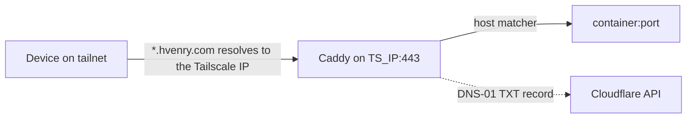

# Ingress

How a request reaches a service: Tailscale decides who can connect, Caddy terminates TLS and routes by hostname, and each app's own login decides who gets in.

## Why

Every service needs a stable HTTPS name that works from a phone, without opening a single port to the internet.
Tailscale Serve alone cannot do this: its certificates cover the machine name only, so every service would need its own port.
A wildcard name on a real domain gives `https://<name>.hvenry.com` for everything, reachable only from the tailnet.

The ways in, and why an overlay network won:

- **Port forwarding** exposes the service to the internet; scanners find exposed Jellyfin and *arr instances within hours.
- **A tunnel service** (Cloudflare Tunnel) needs no open port but puts a third party in the path, and its terms often restrict streaming media.
- **An overlay network** (Tailscale) makes nothing public; only enrolled devices reach the server.
  Every viewer has a device that can run the client, so it is the right default for a personal server.

## How it works

- **DNS:** `*.hvenry.com` is an A record to the machine's Tailscale address (`100.x.y.z`), set to DNS only in Cloudflare.
  It resolves for anyone and reaches nothing unless the device is on the tailnet.
  `hvenry.com` and `www` are proxied with a Redirect Rule to the personal site.
- **TLS:** Caddy holds one wildcard certificate obtained over ACME DNS-01 with `CLOUDFLARE_API_TOKEN` (scoped to `Zone:DNS:Edit` on this zone).
  Nothing needs to be publicly reachable to issue it.
- **Bind:** Caddy publishes `${TS_IP}:443` only.
  With Tailscale Serve "tailnet only" was structural; with Caddy it comes entirely from this bind address.
- **Routing:** one `@name host name.hvenry.com` matcher per service in `Caddyfile`, proxied to the container name and port; anything else gets a 404.
- **Fallback:** every service with a UI except Prometheus also publishes `127.0.0.1:<port>`, reachable with `ssh -L <port>:127.0.0.1:<port> hvenrylab`.
- **Logins:** there is no SSO; Keycloak and oauth2-proxy were removed once it was clear nothing routed through them.
  clear-rag and ootd have no login at all, so Tailscale is their only boundary.

| Service | URL | Fallback |
|---|---|---|
| Dashboard | https://lab.hvenry.com | `127.0.0.1:3000` |
| Jellyfin | https://jellyfin.hvenry.com | `127.0.0.1:8096` |
| Radarr | https://radarr.hvenry.com | `127.0.0.1:7878` |
| Sonarr | https://sonarr.hvenry.com | `127.0.0.1:8989` |
| Bazarr | https://bazarr.hvenry.com | `127.0.0.1:6767` |
| clear-rag | https://rag.hvenry.com | `127.0.0.1:8010` |
| ootd | https://ootd.hvenry.com | `127.0.0.1:3004` (dev), `3003` (built) |
| ntfy | https://ntfy.hvenry.com | `127.0.0.1:8082` |
| Grafana | https://grafana.hvenry.com | `127.0.0.1:3001` |
| Uptime Kuma | https://uptime.hvenry.com | `127.0.0.1:3002` |
| Prometheus | https://prometheus.hvenry.com | none |
| Glances | https://glances.hvenry.com | `127.0.0.1:61208` |

Adding a service:

1. Stack entry with a `127.0.0.1` port and a pinned tag.
2. `Caddyfile` `@name host` block, then `docker exec caddy caddy reload --config /etc/caddy/Caddyfile`.
3. `homepage/services.yaml` entry (see [Dashboard](dashboard.md)).
4. `config/diun/images.yml` entry if the image comes from a registry.

## Tech

- Tailscale (MagicDNS, SSH, key expiry disabled for this machine)
- Caddy built with the Cloudflare DNS module (`ghcr.io/caddybuilds/caddy-cloudflare`); stock `caddy:2` cannot solve DNS-01 against Cloudflare
- Cloudflare DNS

## Key files

- `Caddyfile` - wildcard site block and one host matcher per service
- `stacks/platform.yaml` - Caddy's port bind and token
- `data/caddy/` - ACME account key and issued certificates (root-owned)

## Decisions and gotchas

- **Never bind `0.0.0.0`.** Docker's iptables rules sit ahead of ufw, so a published port bypasses the host firewall and lands on the LAN.
- A wildcard record and certificate keep individual service names out of public DNS and Certificate Transparency logs.
- Cloudflare cannot proxy the `100.64.0.0/10` range; orange-clouding `*` returns 522.
- Tailscale's Global nameservers are set to Cloudflare with **Override local DNS**, so a router that cached the domain as nonexistent cannot keep breaking it.
- `Caddyfile` is a single-file bind mount: an editor that saves by replacing the file leaves the container reading the old inode until `docker restart caddy`.
- Plain `http://` names fail to connect; nothing listens on port 80.
- If Caddy breaks, `tailscale serve --bg --https=443 http://127.0.0.1:8096` gets Jellyfin back.
- `tailscale set --hostname=` renames without resetting other preferences, which `tailscale up` can do silently.
- Device keys expire by default and the server then silently drops off the tailnet; expiry is disabled for `hvenrylab`.
- Funnel (public exposure) is unused; recognise it so it is never enabled by accident.
- Every client needs Tailscale: phones, laptops and Apple TV run it, most smart-TV built-in apps cannot.
- **No SSO.** Keycloak and oauth2-proxy were removed because nothing routed through them.
  If SSO returns as forward auth (Caddy `forward_auth` to oauth2-proxy), it is only as strong as the network: the apps behind it have no auth of their own, and the *arrs' `External` mode trusts whatever is in front, so no app may keep a reachable port.
  API keys and native TV and mobile clients bypass forward auth regardless.

## Related

- [Compose layout](compose-layout.md)
- [Dashboard](dashboard.md)
- [Architecture](architecture.md)
