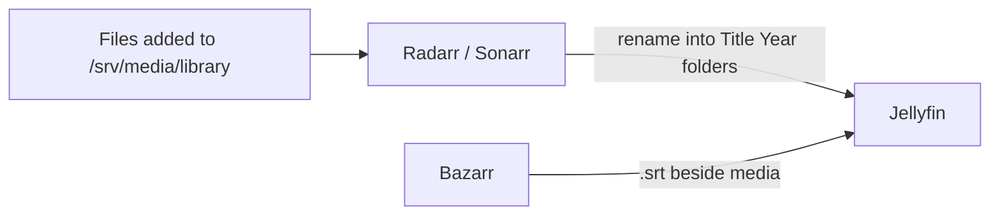

# Library managers

Radarr (films), Sonarr (TV) and Bazarr (subtitles): the layer that names, organises and subtitles media already on disk.

## Why

Correct naming is what makes Jellyfin match metadata without intervention, and renaming a library by hand does not scale.
Radarr and Sonarr are usually the front of a download pipeline; used on their own, with no indexers and no download client, they are a metadata and file-organisation layer.

## How it works

- All three mount `${MEDIA_DIR}` read-write at `/data/library`, because renaming files is the point.
- **Radarr and Sonarr** each have a login and a root folder, and no download client or indexers:

| Setting | Radarr | Sonarr |
|---|---|---|
| Root folder | `/data/library/movies` | `/data/library/tv` |
| Naming | `{Movie Title} ({Release Year})` for file and folder | `{Series Title} ({Series Year})`, `Season {season:00}`, `{Series Title} - S{season:00}E{episode:00} - {Episode Title}` |
| Import | Movies, Import, Library Import | Series, Import |

Imported titles are unmonitored: monitoring exists to trigger searches, and there is nothing to search.
The dashboard warnings about missing download clients and indexers are expected.

- **Bazarr** uses OpenSubtitles.com, one `English` profile (cutoff `en`, type Normal, Use Original Format off so it converts to SRT) set as the default for Series and Movies separately.
  It connects to `sonarr:8989` and `radarr:7878`, base URL `/`, SSL off, with each app's API key from Settings, General.

## Tech

- Radarr, Sonarr, Bazarr (LinuxServer.io images)
- TMDB, OpenSubtitles.com

## Key files

- `stacks/media.yaml` - all three services and their library mount
- `data/radarr/config.xml`, `data/sonarr/config.xml` - settings, including the API key

## Decisions and gotchas

- Review Library Import matches before confirming: a wrong TMDB guess becomes a wrong rename.
- Snapshot the library before a bulk rename so a bad naming rule is reversible: `find /srv/media/library -type f | sort > ~/library-before.txt`.
- A Bazarr language profile that is not set as a default applies to nothing.
- Image-based subtitles (PGS) force a full transcode in Jellyfin; Bazarr's SRT files cost nothing to play.
- Jellyfin's own OpenSubtitles plugin is a lighter alternative, without per-language profiles or scheduled re-searches.

## Related

- [Jellyfin](jellyfin.md)
- [Storage](storage.md)
